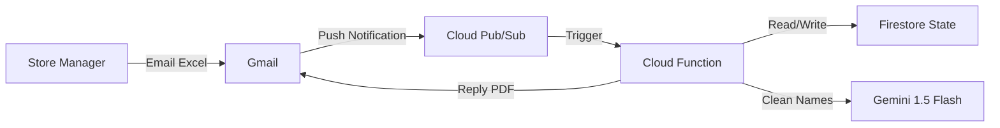

# Smart Shelf Labels

Smart Shelf Labels is an automated automated signage generator for retail stores. It streamlines the process of creating professional, clean, and consistent shelf labels by integrating with email workflows and leveraging AI for content optimization.

## Features

- **Automated Workflow**: Monitors a Gmail inbox for Excel files containing product updates.
- **AI-Powered Cleaning**: Uses Google Gemini to clean up messy ERP product names into customer-friendly text (e.g., removing internal codes, fixing formatting).
- **Professional Design**: Generates high-quality PDF signage with price formatting, barcodes, and promotional "Sale" badges.
- **Smart Printing**: intelligently filters products to only print signs for new items or price changes, saving paper and ink.
- **Cloud Ready**: Designed to run as a Google Cloud Function for 24/7 automation.

## Tech Stack

- **Language**: Python 3.10+
- **Core Libraries**: 
    - `pandas` (Data processing)
    - `reportlab` (PDF generation)
    - `google-cloud-firestore` (State management)
    - `google-generativeai` (LLM processing)
- **Infrastructure**: Google Cloud Platform (Cloud Functions, Pub/Sub, Firestore, Gmail API)

## Setup

1. **Clone the repository**
   ```bash
   git clone https://github.com/yourusername/smart-shelf-labels.git
   cd smart-shelf-labels
   ```

2. **Install Dependencies**
   ```bash
   python -m venv .venv
   source .venv/bin/activate  # On Windows: .venv\Scripts\activate
   pip install -r requirements.txt
   ```

3. **Environment Configuration**
   Create an `env.yaml` file (do not commit this!) with your credentials:
   ```yaml
   GEMINI_API_KEY: 'your_api_key_here'
   GMAIL_TOKEN_JSON: '{"token": "..."}' # From Google OAuth flow
   ```

4. **Run Locally**
   ```bash
   python main.py
   ```

## Architecture



## Deployment

The project includes a custom deployment automation script to simplify the detailed `gcloud` configuration.

```bash
python scripts/deploy_cloud_function.py
```

This script automates:
1.  **Secret Injection**: Merges local `token.json` credentials into runtime environment variables.
2.  **Configuration**: Sets memory (512MB), region, and Pub/Sub triggers.
3.  **Deployment**: Pushes the code to Google Cloud Functions (Gen 2).

## Technical Highlights

- **Complex Hebrew Support**: Solved classic Python PDF issues with Right-to-Left (RTL) languages using `arabic-reshaper` and `python-bidi` for correct text rendering.
- **Cost Optimization**: Implemented specific logic to check Firestore state, ensuring new signs are generated *only* for products that have changed price or are new, significantly reducing printing waste.
- **Resilient AI**: Uses Few-Shot prompting with Google Gemini to reliably standardize varied ERP product names into clean, uniform label text.

## Example Output


*Example of generated shelf labels showing clear pricing, barcodes, and product descriptions.*
